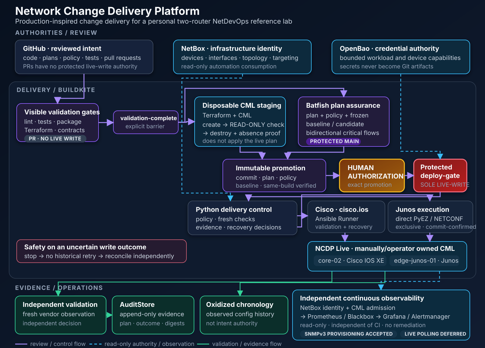

# Network Change Delivery Platform

NCDP is a production-inspired personal NetDevOps reference platform for
reviewed, assured, human-authorized, auditable, and observable network changes.
It demonstrates how a network change can move from Git intent to independently
validated Cisco IOS XE or Junos execution without collapsing review, inventory,
credentials, delivery, evidence, and operations into one automation script.

The platform runs on one Mac with a personal CML environment. It has exercised
protected Cisco and Junos live changes, including retained fail-closed and
no-retry evidence, but it is a learning, portfolio, and demonstration system—not
a production deployment template.

## How the platform works

1. **Review intent.** GitHub holds reviewed code, managed intent, plans, policy,
   tests, and pipeline definitions. A pull request has no protected live-write
   authority.
2. **Validate visibly.** Buildkite exposes lint, tests, packaging, Terraform
   validation, and pipeline contracts as separate gates that converge at
   `validation-complete`.
3. **Exercise integration and assurance.** Runtime-relevant changes use a
   disposable Terraform/CML realization for create → read-only validate →
   destroy. On eligible protected-main builds, first-class Batfish assurance
   independently evaluates the exact plan, policy, and frozen baseline/candidate.
4. **Create an immutable promotion.** Promotion waits for CML staging and
   Batfish, downloads the exact same-build assurance artifact, verifies it
   independently, and binds the accepted bytes and digests.
5. **Require a human decision.** Explicit authorization sits between immutable
   promotion and the only Buildkite boundary allowed to request device-write
   capability.
6. **Execute with vendor semantics.** Python owns policy and orchestration.
   Cisco uses Ansible Runner with `cisco.ios`; Junos uses direct PyEZ/NETCONF
   with an exclusive candidate and commit-confirmed safety.
7. **Validate and preserve evidence.** Fresh independent post-validation decides
   success. AuditStore retains append-only typed evidence, while Oxidized records
   observed actual-state chronology.
8. **Observe independently.** NetBox-bound, CML-admitted Prometheus/Blackbox
   probes feed Grafana and Alertmanager without deployment or remediation
   authority. Monitoring does not end when the pipeline does.

## What it demonstrates

- NetBox-authoritative device, interface, topology, and targeting identity
- OpenBao workload identity and bounded device-credential capabilities
- Cisco IOS XE and Junos planning, execution, validation, and recovery
- Terraform-owned disposable CML staging distinct from the persistent live lab
- Batfish plan/policy/baseline binding and bidirectional critical-flow assurance
- Buildkite validation, immutable promotion, explicit approval, and queue separation
- Frozen-fleet canary/wave engine with honest partial outcomes outside the
  current protected single-device Buildkite path
- Append-only AuditStore correlation and private Oxidized Git chronology
- Persistent Prometheus, Blackbox, Grafana, and Alertmanager visibility
- SNMPv3 synthetic integration and accepted protected device provisioning,
  without claiming persistent live polling

## Safety model

NCDP binds review and execution to the exact commit, plan, policy, baseline,
assurance record, and promotion. Protected delivery requires a changed,
commit-bound live request plus explicit human authorization. Immediately before
a write, it re-resolves authoritative identity and checks current device state,
support, safety, and whether work is still required.

SSH and NETCONF trust are strict and realization-anchored. Vendor behavior is
not flattened: Cisco uses bounded Ansible execution and targeted recovery;
Junos preserves candidate locking and commit-confirmed semantics. If a write
outcome is uncertain, the platform stops, never replays the historical job, and
requires independent reconciliation plus a new commit, build, and authorization
for any corrected attempt. No fleet-wide atomicity is claimed.

## Current reference lab

| Area | Current reference implementation |
| --- | --- |
| Purpose | Personal NetDevOps learning, portfolio, and demonstration lab |
| Managed devices | 2 |
| Cisco | `core-02` · Cisco IOS XE |
| Junos | `edge-junos-01` · Junos |
| Persistent lab | Manually/operator-owned `NCDP Live` in CML |
| Disposable staging | Terraform-owned per-run CML realization |
| Inventory | NetBox, consumed read-only by automation |
| Credentials | OpenBao with bounded workload/device authority |
| CI/CD | Buildkite validation, assurance, promotion, authorization, deploy gate |
| Evidence | AuditStore + Oxidized actual-state chronology |
| Observability | Prometheus + Blackbox + Grafana + Alertmanager |
| Persistent SNMP polling | Deferred |
| gNMI/OpenConfig | Deferred/skipped |

## Deliberate scope

- This is a personal-lab reference implementation, not a production-ready or
  enterprise deployment product.
- It uses no company infrastructure or data and claims no high availability,
  enterprise identity governance, organizational separation, or production scale.
- Continuous observability is read-only and has no autonomous remediation
  authority.
- Persistent live SNMP exporter polling is deferred; accepted SNMPv3 provisioning
  does not imply that polling exists.
- The current protected Buildkite path promotes and executes one
  `DeploymentPlan`; protected Buildkite fleet deployment remains deferred.

## Explore

Architecture and operating model:

- [Architecture overview](docs/architecture/overview.md)
- [Buildkite workflow](docs/architecture/buildkite-workflow.md)
- [Change lifecycle](docs/architecture/change-lifecycle.md)
- [Security boundaries](docs/architecture/security-boundaries.md)
- [Recovery safety](docs/architecture/recovery-safety.md)
- [Audit and configuration history](docs/architecture/audit-and-configuration-history.md)
- [Continuous observability](docs/architecture/continuous-observability.md)
- [Architecture decision records](docs/adr/)
- [Current roadmap](docs/roadmap.md)

Selected cumulative acceptance evidence:

- [Increment 7C protected live deployment](docs/acceptance/buildkite-live-deployment-increment-7c.md)
- [Increment 10C-7B protected PRE/write/POST correlation](docs/acceptance/protected-configuration-observation-increment-10c7b.md)
- [Increment 11C SNMPv3 interface telemetry](docs/acceptance/continuous-observability-increment-11c.md)
