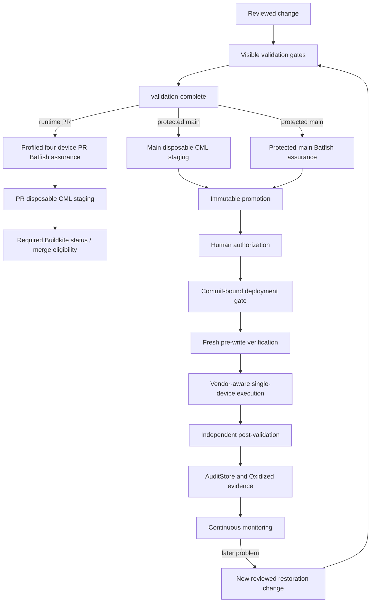

# Change lifecycle

The current protected Buildkite lifecycle binds review, execution, and evidence
to the same immutable single-device plan.

`ncdp profiled-plan` is the separate user-facing ordinary-planning entry point
for the parallel schema-v2 profiled path. It resolves and collects through
profile-bound LIVE read-only authority and writes one immutable local plan; it
has zero device-write authority. Only C8000V IOS-XE and vJunos admit the
current interface-description write lifecycle. IOSv and IOSvL2 remain
managed-fleet members but are rejected before credential or transport access for
that operation. The legacy schema-v1 planning/deployment paths remain
transitional. Disposable staging and protected delivery remain paused.

Schema-v2 now also has the explicit local `ncdp profiled-deploy` activation
surface. It requires `--live`, an exact `sha256:` approval digest, profiled
NetBox/OpenBao authority, and the accepted profiled LIVE trust generation. It
reserves create-only mode-0600 execution evidence before preflight can reach a
write provider. It admits only C8000V IOS-XE and vJunos for
interface-description execution; IOSv and IOSvL2 remain rejected for that
operation. It preserves Cisco one-attempt/targeted-inverse and Junos
commit-confirmed semantics without changing transitional v1 execution.
Controlled LIVE acceptance at PR #132 proved exactly the C8000V IOS-XE and
vJunos interface-description operations: Cisco completed a known-success write
and independent O′ validation without recovery; Junos completed candidate
validation, commit-confirmed, independent O′ observation, and explicit
confirmation. It does not advance B5 D0: interface descriptions are outside the
current B5 envelopes, so a future writable B4 vertical must project fresh O′
through `compare_postwrite_to_d1()` and
`build_postwrite_validated_evidence()` before an accepted-state advance. No
other B4 vertical gained write authority. See the [PR #132 acceptance
record](../acceptance/profiled-deploy-live-acceptance-pr132.md).

Detour B5-1 adds a separate new-architecture managed-state foundation. It
projects observation and intent into the same envelope-scoped canonical form,
resolves D0 from a validated append-only acceptance chain, distinguishes
D0-versus-O drift from D0-versus-D1 proposal change, and requires O' to equal D1
before a future accepted-state advance. B5-2 adds the commit-bound, two-pass,
continuity-gated one-shot initializer for the first real D0; it does not add
execution authority. See [managed state and drift](managed-state-drift.md).
The accepted run initialized four independent generation-one chains and proved
fresh O equals D0 for each; current Git D1 remains a four-vertical proposed
change. B5-3 then demonstrated the read-only drift boundary: one manual
`no shutdown` on `transit-ios-01/GigabitEthernet0/1` produced routed-underlay
drift, a manual `shutdown` restored D0, and no NCDP-authorized device write or
D0 advancement occurred. See the [B5-3 acceptance record](../acceptance/managed-state-controlled-drift-detour-b5-3.md).

During Detour B3, the disposable CML step and complete protected-delivery group
are temporarily commented out together. The lifecycle below remains the
accepted design if the operator explicitly decides disposable CML staging is
useful again after its Terraform topology is ready for the intended profiled
population. Both blocks must be restored together; no protected live path is
active during the pause.

Validation fails closed before privilege. Runtime-relevant same-repository pull
requests run offline Batfish assurance for the exact profiled four-device
candidate. Its current service stack is `routed_underlay, ospf, vlan, acl`, with separate
normalized service-subject digests, and it requires no
live inventory, credential, CML, trust, or device surface. Disposable CML and
the protected-delivery group remain paused. The profiled PR assurance artifact
is prevention evidence only and is not reused by the preserved legacy
protected-main branch.

The current protected promotion contains one `DeploymentPlan`. Planning records
canonical intent, inventory identity, preconditions, vendor-aware operations,
validation, and recovery expectations; its canonical digest binds the human
preview to machine execution. Batfish evidence is bound to the exact plan,
policy, baseline, derived candidate, and commit. CML staging proves the
independently disposable two-router runtime and real read-only provider paths;
it does not apply the proposed live plan.

Immediately before execution, fresh checks confirm commit, plan, target
identity, state, support, and still-required work. A stale, changed, missing, or
unsupported plan stops. The gate performs one vendor-aware device attempt;
ambiguous writes are not retried, and command success is insufficient because
independent post-change validation decides deployment success.

## Fleet engine boundary

Separately, the platform fleet engine accepted through Increment 5C supports
frozen fleets including no-op targets, representative canaries, bounded waves,
strict stop gates, honest partial evidence, and final whole-fleet validation.
The current protected Buildkite path does not promote or execute a fleet plan;
Buildkite fleet deployment remains unsupported/deferred. Neither the fleet
engine nor the protected path implies fleet-wide atomicity.

Immediate recovery uses proven vendor-native semantics for the supported
change. A later regression is handled as a new reviewed desired-state change
through the ordinary delivery lifecycle. Git revert may produce that proposed
Git change, but is history manipulation rather than device-change
authorization. Automated historical ancestry reconstruction, inverse
generation, and later-change conflict handling are deferred. Monitoring
continues independently after pipeline completion. See
[recovery safety](recovery-safety.md).

## Promotion before deployment

The currently disabled legacy immutable promotion downloads the exact
same-build `batfish-assurance`
artifact, independently verifies it against the checked-out plan, policy, and
baseline, packages the promotion, and records its digests. Human approval
authorizes that exact promotion. The serialized, non-retriable deployment gate
independently verifies the bundle and commit-bound live request before any
privileged device boundary. The active profiled PR artifact is deliberately not
compatible promotion input. Increment 7C live enforcement is accepted; a
corrected attempt always requires a new commit/build/authorization rather than
retrying historical work.
