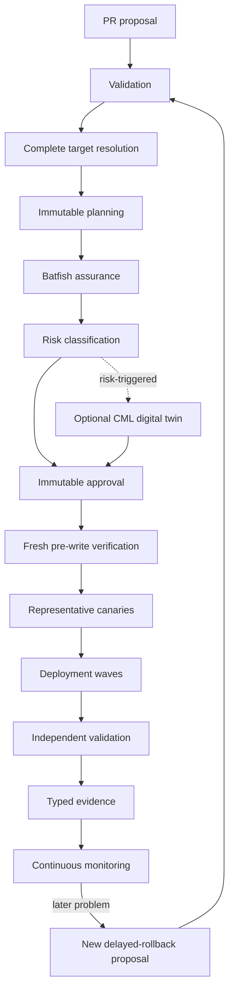

# Change lifecycle

The lifecycle binds review, execution, and evidence to the same immutable plan
while treating fleet rollout as a controlled state machine rather than a simple
device loop.

Validation fails closed before privilege. Target resolution freezes the complete
fleet, including no-op targets, before writes. Planning records canonical intent,
inventory identity, preconditions, vendor-aware operations, validation, and
recovery expectations; its canonical digest binds the human preview to machine
execution. Batfish evidence, risk, and optional CML evidence enrich that artifact.

Immediately before execution, fresh checks confirm commit, plan, target identity,
state, support, and still-required work. A stale, changed, missing, or unsupported
plan stops. One canary per representative platform is validated before bounded
waves. Each failed wave stops later waves; ambiguous writes are not retried and
partial outcomes remain explicit. Command success is insufficient—independent
post-change validation decides deployment success.

Immediate recovery uses proven vendor-native semantics for the supported change.
A later regression creates a new reviewed rollback change. It evaluates original
pre-change state and plan, subsequent approved changes, current desired state,
and live state, then produces a safe inverse or blocks on conflict. Git revert is
history manipulation, not device-change authorization. Monitoring continues
independently after pipeline completion.
