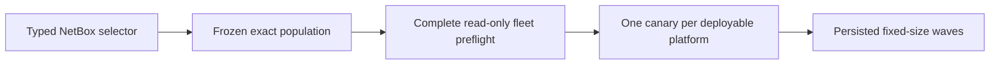

# Fleet rollout planning and read-only preflight

## Scope and authority

Increment 5A adds Python-owned fleet selection, immutable planning, deterministic
cohorts, and reusable complete read-only preflight. NetBox owns device and
interface targeting identity. Git-owned typed intent owns the desired interface
description and rollout policy. The existing single-device `DeploymentPlan` and
`deploy_plan` contracts remain authoritative for later device transactions.

There is no `fleet-deploy` command in 5A and no execution provider is reachable
from fleet preflight.

## Narrow selector

`NetBoxFleetSelector` contains exactly a device tag and an interface tag. It is
not an arbitrary query language. Runtime selection uses bounded paginated GETs
with verified TLS, explicit timeouts, no redirects, and `trust_env=False`.

Every selected device must be active, carry both `ncdp-managed` and the exact
device selector tag, use `cisco-ios-xe` or `juniper-junos`, and have a primary
IPv4 address and stable object identity. The interface selector tag must resolve
to exactly one stable interface identity on every device. A protected target,
zero/multiple interface matches, zero devices, duplicates, unsupported platforms,
or incomplete pagination blocks the whole resolution.

API return order is never policy. Frozen members are ordered by stable NetBox
device identity, then target name and stable interface identity. NetBox device
and tagged-interface pagination requests explicitly use `ordering=id` so offset
pagination itself is stable before the domain layer applies its local sort.

## Frozen plan and no-ops

Every selected member is retained as either:

- `DEPLOYABLE`, with the full exact existing `DeploymentPlan` embedded; or
- `COMPLIANT`, with no child plan and an observation proving the desired
  description is already present.

Validators prevent duplicated member fields from disagreeing with child plans.
Every frozen member explicitly records `inventory_source: netbox`; a deployable
child using any other inventory authority is invalid even if its own digest is
internally valid.

The canonical fleet SHA-256 digest binds the selector, desired state, rollout
policy, full member population, nested child plans and their digests, compliant
members, exact canaries, exact waves, and cohort order. Filenames and external
mutable references are not part of the approval contract.

An entirely compliant fleet returns complete observations and
`fleet is already compliant; no deployable artifact produced`. A partially
compliant fleet retains no-op members in the artifact but never places them in a
write cohort.

`fleet-plan --plan-out` refuses an existing file or symlink before provider
construction. A deployable artifact is created once through an exclusive
mode-0600 create boundary and is never silently overwritten. An all-compliant
result creates no file, so an older artifact cannot remain ambiguously associated
with a later no-op invocation at the same output path.

## Deterministic exposure cohorts

For each platform represented by at least one deployable member, v1 chooses the
lowest stable member key as its sole representative canary. Platforms containing
only compliant members need no canary. After removing canaries, remaining
deployable members are sorted by the same stable key and split into exact
fixed-size waves. Both membership and order are persisted; they are not
recomputed at execution time.

A staging environment or digital twin is pre-deployment assurance. A canary is
a deliberately limited first exposure inside the real approved target
population. Staging/digital-twin testing is not a canary and cannot replace the
canary gate.

## Complete read-only preflight

`preflight_fleet` verifies the fleet digest and optional approval digest, then
re-resolves the original selector and requires the exact device/interface
identity set to match. It uses the same extracted single-device read-only
prewrite boundary as `deploy_plan` for inventory endpoint/platform binding,
credential provenance, fresh credential load, live collection, hostname,
physical-interface existence, and protection policy.

Deployable members must still match their embedded child-plan preconditions.
Compliant members must remain at desired state. All selected members are checked;
one failure makes the whole result fail. The boundary takes no executor and
cannot perform a device write.

Increment 5B may add sequential execution only after review. It must rerun this
complete preflight before the first write, retain just-in-time child verification,
gate later cohorts on canary success, stop after any non-`SUCCEEDED` attempted
transaction, preserve vendor-native recovery semantics, and make no fleet
atomicity or automatic rollback claim.

Increment 5C retains rollout-level ownership of process-local same-target
overlap admission and mixed-vendor live CML fleet acceptance. Increment 7 owns
distributed and cross-run locks, Buildkite runner concurrency groups, and
multi-worker coordination. Local rollout overlap safety and distributed runner
coordination are separate layers; deferring the latter does not remove the former
from Increment 5.
