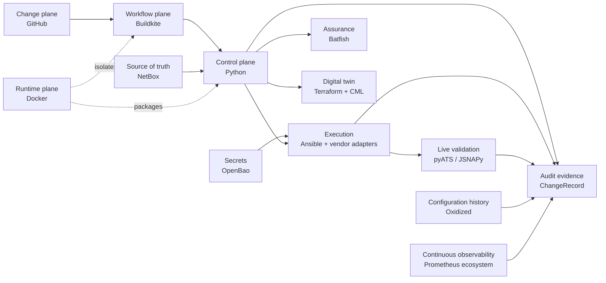

# Architecture overview

Architecture is organized around functions and contracts, not permanent tool
coupling. Policy flows from reviewed intent toward increasingly privileged
operations; observations and evidence flow back without secrets.

## Planes and responsibilities

- **Change:** GitHub stores source, desired managed state, policy, tests,
  pipeline definitions, review, and history.
- **Workflow:** Buildkite will orchestrate stages, gates, approvals, queues,
  concurrency, artifacts, and schedules.
- **Runtime:** Docker and future Compose provide reproducible execution and
  isolated supporting services.
- **Control/application:** Python 3.12 owns domain policy, target resolution,
  planning, risk, rollout, evidence, recovery decisions, and composition.
- **Source of truth:** NetBox owns infrastructure identity, topology/IPAM
  relationships, platform, role, tags, targeting, and inventory metadata. Git
  owns managed device-configuration intent. A managed property has exactly one
  authority, explicitly assigned before overlapping NetBox/native fields are
  consumed; devices provide observed state.
- **Secrets:** OpenBao AppRole issues short-lived, single-use, exact-path tokens
  for the static personal-lab device credential. Future Buildkite OIDC replaces
  AppRole bootstrap; application models never embed secret values.
- **Assurance:** Batfish performs offline multi-vendor behavioral checks; the
  plan-bound 6B path derives candidates from validated plans and remains a
  verification primitive until Increment 7 workflow enforcement.
- **Digital twin:** Increment 8 uses Terraform with CiscoDevNet CML2 to own a
  separate personal-CML twin's infrastructure lifecycle, never production
  device configuration. See the
  [Terraform/CML digital-twin architecture](terraform-cml-digital-twin.md).
- **Execution:** Ansible Runner with `cisco.ios` remains the Cisco provider.
  Direct PyEZ/NETCONF preserves one Junos exclusive candidate session across
  pre-commit policy approval. Python decides what and why; adapters implement
  how without flattening vendor safety semantics.
- **Live validation:** future pyATS/Genie for Cisco and JSNAPy/PyEZ for Junos
  normalize into platform-owned results.
- **Audit/evidence:** existing `ChangeRecord` and `FleetChangeRecord` types hold
  bounded execution evidence. A future top-level record will correlate them
  with immutable pipeline artifacts by stable identity and digest; see
  [Audit and configuration history](audit-and-configuration-history.md).
- **Continuous observability:** future Prometheus, Grafana, Alertmanager, gNMIc,
  OpenConfig/gNMI, SNMP Exporter, and Blackbox Exporter run independently of CI.
  Actionable alerts must pass through Alertmanager to at least one configured
  demonstration notification receiver; receiver selection is deferred. Oxidized
  with Git provides configuration chronology and drift evidence.

Dependencies point inward to platform-owned policy and types; integrations
implement explicit boundary contracts. Provider details must not become domain
policy, and external observations must be normalized before policy consumes them.

## Implemented now

Architecture Baseline 1 and the first narrow Cisco IOS XE interface-description
vertical are implemented. Increment 3 adds the primary read-only NetBox inventory
path while retaining local YAML for isolated and offline work. OpenBao is the
primary credential path, with AppRole and exact KV-v2 retrieval behind the secret
boundary. See the [NetBox inventory provider](netbox-inventory-provider.md) and
[OpenBao secret provider](openbao-secret-provider.md).
Increment 4 adds the first Junos planning and transaction implementation. Cisco
configuration remains on Ansible Runner; implementation evidence required Junos
candidate transactions to use direct PyEZ so Python can approve the same locked
candidate before commit-confirmed. See the [Cisco](cisco-interface-description-vertical.md)
and [Junos](junos-interface-description-vertical.md) vertical documents.
Increment 5A adds [fleet rollout planning](fleet-rollout.md): narrow paginated
NetBox selectors, exact frozen membership including no-ops, nested child plans,
canonical fleet digests, deterministic representative canaries and waves, and
complete read-only fleet preflight. Increment 5B adds digest-approved sequential
execution of those exact cohorts through the unchanged single-device workflow,
strict `SUCCEEDED`-only continuation, honest stopped/partial evidence, and final
whole-fleet read-only desired-state validation. Live mixed-vendor acceptance and
process-local overlap admission are Increment 5C: a shared in-memory controller
atomically reserves complete stable device-identity sets, including no-ops,
across preflight, execution, and final validation. It is deliberately not a
distributed lock. Other named integrations remain future work.

Increment 7 is complete: protected promotion, Buildkite/OpenBao workload
identity, commit-bound least-privilege deployment, real personal-CML device
acceptance, independent validation, and same-build deployment retry hardening
are externally accepted. See the
[Buildkite live-deployment boundary](buildkite-live-deployment.md).
Increment 8 has completed 8A discovery and now implements the accepted 8B
Terraform foundation and read-only plan. The repository has no
Terraform-managed CML resource yet; CML topology and lifecycle begin in 8C. See the
[Terraform/CML digital-twin architecture](terraform-cml-digital-twin.md).
