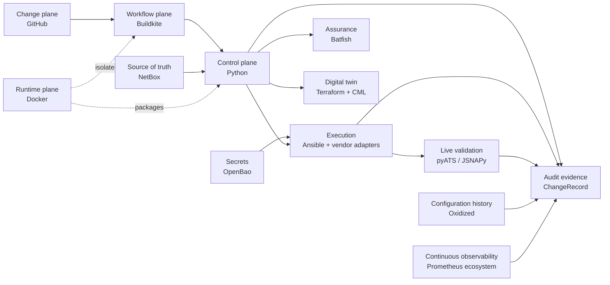

# Architecture overview

Architecture is organized around functions and contracts, not permanent tool
coupling. Policy flows from reviewed intent toward increasingly privileged
operations; observations and evidence flow back without secrets.

## Planes and responsibilities

- **Change:** GitHub stores source, desired managed state, policy, tests,
  pipeline definitions, review, and history.
- **Workflow:** Buildkite will orchestrate stages, gates, approvals, queues,
  concurrency, artifacts, and schedules.
- **Runtime:** Docker and future Compose provide reproducible execution and
  isolated supporting services.
- **Control/application:** Python 3.12 owns domain policy, target resolution,
  planning, risk, rollout, evidence, recovery decisions, and composition.
- **Source of truth:** NetBox owns infrastructure identity, topology/IPAM
  relationships, platform, role, tags, targeting, and inventory metadata. Git
  owns managed device-configuration intent. A managed property has exactly one
  authority, explicitly assigned before overlapping NetBox/native fields are
  consumed; devices provide observed state.
- **Secrets:** OpenBao AppRole issues short-lived, single-use, exact-path tokens
  for the static personal-lab device credential. Future Buildkite OIDC replaces
  AppRole bootstrap; application models never embed secret values.
- **Assurance:** future Batfish performs offline multi-vendor behavioural checks.
- **Digital twin:** future Terraform with CiscoDevNet CML2 owns CML lifecycle,
  never production device configuration.
- **Execution:** future Ansible Core is the initial provider using `cisco.ios`
  and `juniper.device`/PyEZ/NETCONF paths. Python decides what and why; adapters
  implement how without flattening vendor safety semantics.
- **Live validation:** future pyATS/Genie for Cisco and JSNAPy/PyEZ for Junos
  normalize into platform-owned results.
- **Audit/evidence:** a future typed `ChangeRecord` correlates every approved
  input, artifact, action, validation, outcome, and recovery ancestor.
- **Continuous observability:** future Prometheus, Grafana, Alertmanager, gNMIc,
  OpenConfig/gNMI, SNMP Exporter, and Blackbox Exporter run independently of CI.
  Actionable alerts must pass through Alertmanager to at least one configured
  demonstration notification receiver; receiver selection is deferred. Oxidized
  with Git provides configuration chronology and drift evidence.

Dependencies point inward to platform-owned policy and types; integrations
implement explicit boundary contracts. Provider details must not become domain
policy, and external observations must be normalized before policy consumes them.

## Implemented now

Architecture Baseline 1 and the first narrow Cisco IOS XE interface-description
vertical are implemented. Increment 3 adds the primary read-only NetBox inventory
path while retaining local YAML for isolated and offline work. OpenBao is the
primary credential path, with AppRole and exact KV-v2 retrieval behind the secret
boundary. See the [NetBox inventory provider](netbox-inventory-provider.md) and
[OpenBao secret provider](openbao-secret-provider.md).
The vertical's exact boundaries are documented in the
[Cisco interface-description vertical](cisco-interface-description-vertical.md).
All other named integrations remain future work.
