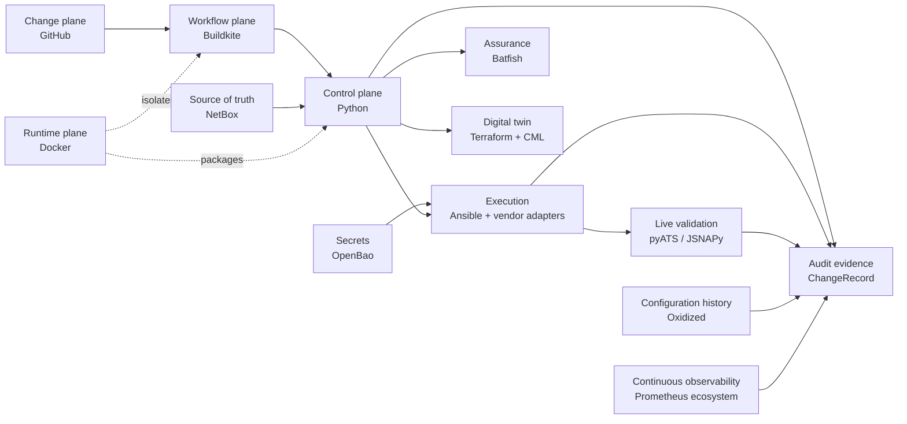

# Architecture overview

Architecture is organized around functions and contracts, not permanent tool
coupling. Policy flows from reviewed intent toward increasingly privileged
operations; observations and evidence flow back without secrets.

## Planes and responsibilities

- **Change:** GitHub stores source, desired managed state, policy, tests,
  pipeline definitions, review, and history.
- **Workflow:** Buildkite will orchestrate stages, gates, approvals, queues,
  concurrency, artifacts, and schedules.
- **Runtime:** Docker and future Compose provide reproducible execution and
  isolated supporting services.
- **Control/application:** Python 3.12 owns domain policy, target resolution,
  planning, risk, rollout, evidence, recovery decisions, and composition.
- **Source of truth:** future NetBox owns infrastructure identity, topology/IPAM
  relationships, platform, role, tags, targeting, and inventory metadata. Git
  owns managed device-configuration intent. A managed property has exactly one
  authority, explicitly assigned before overlapping NetBox/native fields are
  consumed; devices provide observed state.
- **Secrets:** future OpenBao validates Buildkite OIDC and issues short-lived,
  narrowly scoped credentials; application models never embed static secrets.
- **Assurance:** future Batfish performs offline multi-vendor behavioural checks.
- **Digital twin:** future Terraform with CiscoDevNet CML2 owns CML lifecycle,
  never production device configuration.
- **Execution:** future Ansible Core is the initial provider using `cisco.ios`
  and `juniper.device`/PyEZ/NETCONF paths. Python decides what and why; adapters
  implement how without flattening vendor safety semantics.
- **Live validation:** future pyATS/Genie for Cisco and JSNAPy/PyEZ for Junos
  normalize into platform-owned results.
- **Audit/evidence:** a future typed `ChangeRecord` correlates every approved
  input, artifact, action, validation, outcome, and recovery ancestor.
- **Continuous observability:** future Prometheus, Grafana, Alertmanager, gNMIc,
  OpenConfig/gNMI, SNMP Exporter, and Blackbox Exporter run independently of CI.
  Actionable alerts must pass through Alertmanager to at least one configured
  demonstration notification receiver; receiver selection is deferred. Oxidized
  with Git provides configuration chronology and drift evidence.

Dependencies point inward to platform-owned policy and types; integrations
implement explicit boundary contracts. Provider details must not become domain
policy, and external observations must be normalized before policy consumes them.

## Implemented now

Technology selection is not implementation. PR #1 implements only repository
structure, documentation baseline, Python CLI shell, Docker foundation, and one
Buildkite quality-pipeline definition. Every named network, assurance, inventory,
secret, lab, validation, history, and observability integration remains future work.
