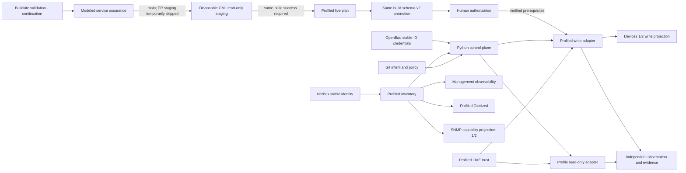

# Architecture overview

NCDP's current managed architecture is a profiled managed population with
explicit per-profile capability projections. Policy flows from reviewed intent
toward narrowly admitted operations; observations and secret-free evidence flow
back without granting write authority.

## Population and capability authority

`ncdp-profiled-inventory` plus `PROFILED_POPULATION_CATALOG` admits exactly:

1. `core-02` — `netbox:dcim.device:1` — `cat8000v_iosxe`;
2. `edge-junos-01` — `netbox:dcim.device:2` — `vjunos_router`;
3. `transit-ios-01` — `netbox:dcim.device:8` — `iosv_159_3_m12`;
4. `access-sw-01` — `netbox:dcim.device:9` — `iosvl2_2020`.

Population admission grants no operation by itself. The present catalog has fixed
identity/count constraints; generalization is
approved under CAP-POPULATION-SCOPES, not implemented here. The current writable
interface-description projection contains only devices 1 and 2. IOSv and
IOSvL2 fail closed before credentials or transport. The SNMPv3
SHA256/AES128 projection also currently contains devices 1 and 2 because the
accepted IOSv/IOSvL2 software lacks that capability. Management observability
and Oxidized read-only collection consume all four.

## Planes and responsibilities

- **Change:** Git owns desired intent, profile/operation catalogs, policy,
  tests, and history.
- **Source of truth:** NetBox owns stable device/interface and factual topology
  identity. The normal provider is GET-only.
- **Control:** Python owns admission, planning, approval binding, sequencing,
  outcome classification, recovery eligibility, and evidence construction.
- **Secrets:** OpenBao supplies exact stable-device-ID credential reads with short-lived tokens.
  Secret values never enter plans, records, output, or Git.
- **Trust:** the CML-anchored profiled LIVE generation is explicit;
  ambient SSH trust, auto-add, discovery, and fallback are forbidden.
- **Execution:** `ProfiledWriteAdapter` is a closed operation/profile mapping.
  Cisco uses strict Ansible `network_cli`; Junos uses PyEZ NETCONF with an
  exclusive candidate and commit-confirmed.
- **Evidence:** schema-v2 `ProfiledChangeRecord` preserves reviewed identities,
  stages and exact plan/approval digests. The provider-derived `execution.changed`
  flag is not reliable observed-transition evidence; see CAP-OUTCOME-TRUTH.
  Current Buildkite delivery now publishes profiled durable envelopes read by
  the existing viewer; pre-write destination admission is required. This is
  offline-verified integration with runtime acceptance pending. PRE/write/POST
  chronology remains unconnected.
- **Continuous operations:** observability and Oxidized are read-only,
  scoped to admitted profiles, and independent of change execution.
- **Assurance:** Buildkite runs validation plus credential-free profiled
  PR/main Batfish assurance followed on non-PR main by disposable CML read-only staging.
  PR/development staging is temporarily skipped under the ACTIVE ledger exception.
  Commands continue on failure;
  the separate main-only schema-v2 plan/promotion/human/deploy tail independently
  requires successful prerequisites. PRs have no write tail.

## Current change boundary

`ncdp profiled-plan` is the sole ordinary planner. `ncdp profiled-deploy` is the
sole current device-write entry point and requires a schema-v2 plan, exact
canonical digest approval, explicit `--live`, fresh complete preflight, and
create-only evidence. The [current main acceptance](../acceptance/profiled-main-delivery.md)
records positive authorized execution and negative fail-closed continuation,
with user-supplied runtime provenance. Earlier controlled PR #132 acceptance proved one
C8000V and one
vJunos interface-description write with exact independent validation and no
recovery.

The B5 D0/O/D1 state seam is unchanged. Interface descriptions are outside the
current B5 envelopes and schema-v2 execution never advances D0. Routed underlay,
OSPF, VLAN/trunk, and ACL remain read-only proposed D1 verticals.

## Retired and historical architecture

Schema-v1 local planning/deployment, fleet execution, SNMP provisioning writes,
protected Buildkite delivery, and disposable exact-two Terraform/CML staging
are retired from current runtime. The old Terraform operator twin is not a
second current realization; the persistent operator-owned `NCDP Live` proof population is current.

Historical models, ADRs, acceptance records, and audit parsers retain their
original serialized meaning. No current CLI, privileged script, or pipeline
step invokes their executors. Current profiled disposable staging provides read-only
realization/integration
assurance. Schema-v2 protected main delivery is implemented and demonstrated;
profiled fleet rollout and additional write verticals remain separate capabilities.

See [profile-aware population and realization](profile-aware-population-and-realization.md),
[change lifecycle](change-lifecycle.md), [security boundaries](security-boundaries.md),
and the [migration closure](profiled-migration-closure.md).

## Supporting capabilities and evidence boundaries

Batfish's routed-underlay/OSPF/VLAN/ACL proposal model is required assurance,
not derived from the description plan. Terraform owns only disposable staging;
CML LIVE is operator-owned. Staging validates readiness/trust/read-only behavior
and cleanup, never the description candidate. The dedicated deploy AppRole has
a persistent SecretID and short-lived one-use tokens; staging uses separate JWT
roles. Cisco deployment checks pinned collection metadata and the effective
Runner path before credentials/device activity; Junos has its own prerequisite
and transaction semantics.

B5 `ManagedStateStore` durably distinguishes accepted D0, fresh O and proposed
D1 inside ownership envelopes. It is separate from delivery AuditStore.
Historical AuditStore, PRE/write/POST correlation and viewer remain supporting
machinery; current schema-v2 integration is approved future work. Oxidized and
Prometheus/Blackbox → Grafana/Alertmanager operate independently and have no
write authority. Synthetic SNMPv3 validation remains current; persistent live
polling is deferred. Packaging includes pinned Python dependencies, Ansible
collections, quality/runtime containers and static GitHub/Buildkite contracts.
See the [ledger](../roadmap.md) for current implementation versus approval.
