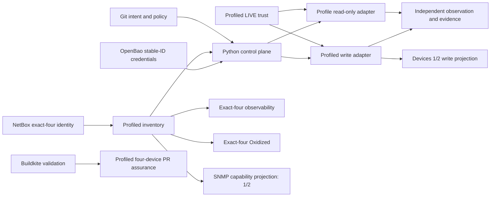

# Architecture overview

NCDP's current managed architecture is one exact-four profiled population with
explicit per-profile capability projections. Policy flows from reviewed intent
toward narrowly admitted operations; observations and secret-free evidence flow
back without granting write authority.

## Population and capability authority

`ncdp-profiled-inventory` plus `PROFILED_POPULATION_CATALOG` admits exactly:

1. `core-02` — `netbox:dcim.device:1` — `cat8000v_iosxe`;
2. `edge-junos-01` — `netbox:dcim.device:2` — `vjunos_router`;
3. `transit-ios-01` — `netbox:dcim.device:8` — `iosv_159_3_m12`;
4. `access-sw-01` — `netbox:dcim.device:9` — `iosvl2_2020`.

Population admission grants no operation by itself. The current writable
interface-description projection contains only devices 1 and 2. IOSv and
IOSvL2 fail closed before credentials or transport. The SNMPv3
SHA256/AES128 projection also currently contains devices 1 and 2 because the
accepted IOSv/IOSvL2 software lacks that capability. Management observability
and Oxidized read-only collection consume all four.

## Planes and responsibilities

- **Change:** Git owns desired intent, profile/operation catalogs, policy,
  tests, and history.
- **Source of truth:** NetBox owns stable device/interface and factual topology
  identity. The normal provider is GET-only.
- **Control:** Python owns admission, planning, approval binding, sequencing,
  outcome classification, recovery eligibility, and evidence construction.
- **Secrets:** OpenBao supplies ephemeral stable-device-ID credential reads.
  Secret values never enter plans, records, output, or Git.
- **Trust:** the CML-anchored exact-four profiled LIVE generation is explicit;
  ambient SSH trust, auto-add, discovery, and fallback are forbidden.
- **Execution:** `ProfiledWriteAdapter` is a closed operation/profile mapping.
  Cisco uses strict Ansible `network_cli`; Junos uses PyEZ NETCONF with an
  exclusive candidate and commit-confirmed.
- **Evidence:** schema-v2 `ProfiledChangeRecord` preserves reviewed identities,
  stages, exact plan/approval digests, and honest final outcome.
- **Continuous operations:** observability and Oxidized are read-only,
  exact-four, and independent of change execution.
- **Assurance:** Buildkite runs validation plus credential-free profiled
  four-device PR Batfish assurance. It has no device-write step.

## Current change boundary

`ncdp profiled-plan` is the sole ordinary planner. `ncdp profiled-deploy` is the
sole current device-write entry point and requires a schema-v2 plan, exact
canonical digest approval, explicit `--live`, fresh complete preflight, and
create-only evidence. Controlled PR #132 acceptance proved one C8000V and one
vJunos interface-description write with exact independent validation and no
recovery.

The B5 D0/O/D1 state seam is unchanged. Interface descriptions are outside the
current B5 envelopes and schema-v2 execution never advances D0. Routed underlay,
OSPF, VLAN/trunk, and ACL remain read-only proposed D1 verticals.

## Retired and historical architecture

Schema-v1 local planning/deployment, fleet execution, SNMP provisioning writes,
protected Buildkite delivery, and disposable exact-two Terraform/CML staging
are retired from current runtime. The old Terraform operator twin is not a
second current realization; the persistent operator-owned exact-four `NCDP
Live` lab is current.

Historical models, ADRs, acceptance records, and audit parsers retain their
original serialized meaning. No current CLI, privileged script, or pipeline
step invokes their executors. Profiled exact-four disposable staging is
implemented with read-only device authority and remains pending controlled
local acceptance and later Buildkite activation. Future profiled fleet rollout,
protected delivery, or additional write verticals require separate review.

See [profile-aware population and realization](profile-aware-population-and-realization.md),
[change lifecycle](change-lifecycle.md), [security boundaries](security-boundaries.md),
and the [migration closure](profiled-migration-closure.md).
